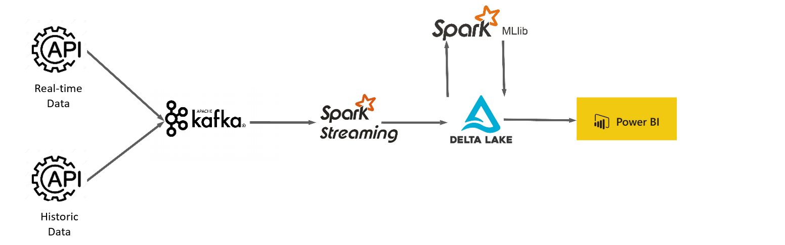
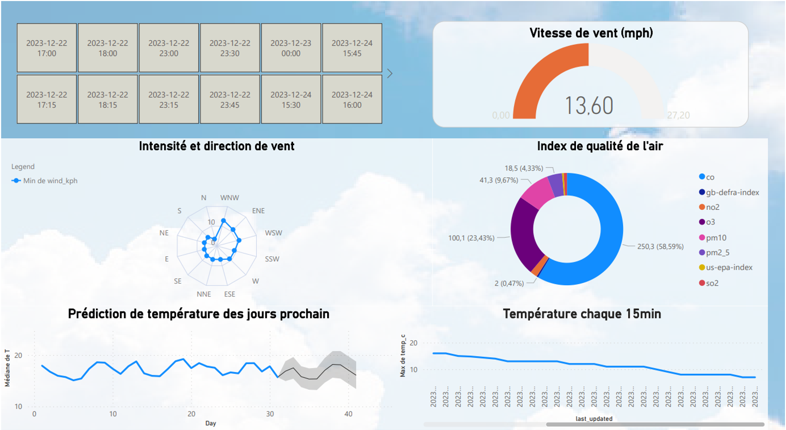

# Weather Streaming and Prediction Project

## Overview

This project is designed to stream weather data from the Maltepell region using the WeatherAPI, process the streaming data in real-time using Apache Kafka and PySpark, store the data in Delta Lake, and utilize historical weather data from an API since 2010.



 Additionally, the project involves training machine learning models, including LSTM, decision tree, random forest, etc., to predict future temperatures. The predictions are then visualized using Power BI.

 


## Setup Instructions

### Prerequisites

- [Apache Spark](https://spark.apache.org/) installed on your system.
- Docker installed to run necessary containers.
- WeatherAPI key for streaming current weather data.
- Historical weather API access for data since 2010.

### Installation Steps

1. Clone the project repository:
   ```bash
   git clone https://github.com/youssefdahmou/Kafka_Spark_Stream_data-analysis.git
   ```

2. Navigate to the project directory:
   ```bash
      cd Kafka_Spark_Stream_data-analysis
   ```
3. Run Docker Compose to set up necessary containers:
```bash
      docker-compose up -d
   ```
4. Run Kafka producer to stream data:
```bash
      python kafka/kafka_producer.py
   ```
5. Run Kafka consumer and Spark streaming script:
```bash
      spark-submit --master local --driver-memory 4g --num-executors 2 --executor-memory 4g --packages org.apache.spark:spark-sql-kafka-0-10_2.12:3.5.0,io.delta:delta-spark_2.12:3.0.0 kafka_consumer.py
   ```
6. Execute Jupyter notebooks for machine learning model training.
7. Visualize predictions using Power BI.

### Project Structure
- kafka_producer.py: Python script to stream weather data to Kafka topic.
- kafka_consumer.py: PySpark script for consuming and processing data from Kafka topic.
- machine_learning: Jupyter notebooks for training machine learning models.
- docker-compose.yml: Docker Compose file for setting up necessary containers.
- data: Directory to store historical weather data.

### Acknowledgments

- This project relies on the WeatherAPI for real-time weather data.
- Historical weather data is sourced from the specified API since 2010.